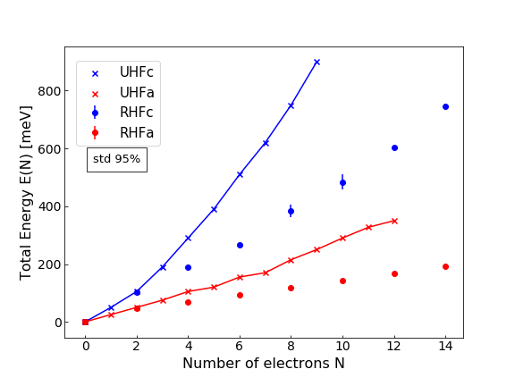
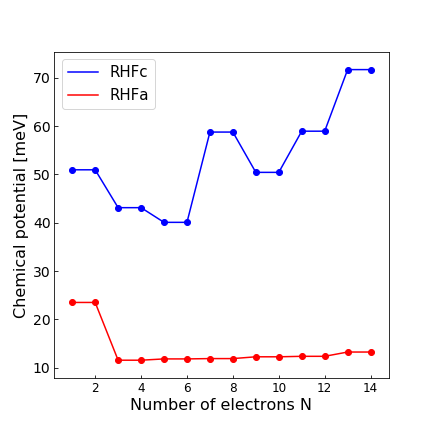

# Weekly progress journal

## Week 1

### Bullet List

1. Create functions for the single energy wave functions @mserraperalta
2. Add spin to single energy wave functions @mserraperalta
3. Search information about Fock matrix and how to implement it @abermejillo
4. Select a method for integrating and start implementing the calculation of the elements of the Fock matrix @abermejillo
6. Search information for a method for solving the Roothaan equations and self-consistent field @dbedialaunetar
7. Select a method for solving the Roothaan equations and start implementing it @dbedialaunetar
8. Join all information and preliminary results from this week in the presentation's slides @dbedialaunetar @mserraperalta @abermejillo

### Progress

1. @mserraperalta added the single electron wave functions: [commit](33ccb28197907fb20752c70115834976e01bc022)
2. The spin does not need to be added, it is taken into account separately (@mserraperalta)
3. There's information on how to compute it in Jos' book, [this link](https://adambaskerville.github.io/posts/HartreeFockGuide/) and this [github repository](https://schoyen.github.io/tdhf-project-fys4411/task-2-ghf-solver.html) (@abermejillo)
4. The integration method will be recycled from the previous project, Monte Carlo Integration: [commit](55eba781cacc37ae9e75f58e05325489f89b0982)
5. There's information on how to solve the Roothaan equations in the same links as 3 (@dbedialaunetar)
6. @dbedialaunetar implemented the algorithm for solving the Roothaan equations [commit](65044a09cd30bb0807ed1a28305c181ba4336bbd)

--------

The aim of this project is to use the Hartree-Fock method to compute some properties of two-dimensional quantum dots. The theory related to this project is quite extensive so, before explaining the implemented code, we will first introduce the necessary concepts to understand its structure.

**Theoretical background**


List of indices:
- i,j: loop over electrons (N_e = number of electrons)
- k: loop over basis elements (N_b = number of basis elements)
- p,q,r,s: loop the matrices (so also counting the basis N_b X N_b)


 The hamiltonian of $`N_e`$ electrons in such a system is given by 

```math
\hat{H}(\bm{r_i})=\sum_{i=1}^{N_e}h_i(\bm{r_i}) + \sum_{i<j}^{N_e} \frac{1}{\bm{r_{ij}}}, 
```

where

```math
h_i(\bm{r_i}) = -\frac{1}{2}\nabla_i^2 + \frac{1}{2}\omega_1(x_i^2+y_i^2) + \frac{1}{2}\omega_2 z_i^2.
```

We can recognise that the electrons will be confined by harmonic potentials, strongly in the z axis to make it two dimensional and more weakly in the xy plane defining the quantum dot.

The basis with which the Hartree-Fock algorithm will be implemented is the solution to Schrödinger's equation of the single particle hamiltonians $`h(r_i)`$, which are nothing but Hermite polynomials

```math
\phi_k (x,y,z) =\psi(x,n_x) \psi (y, n_y) \psi (z, n_z),
```

where $`\psi(x,n)=\frac{1}{\sqrt{2^n n! \pi }}e^{-x^2/2}\mathcal{H}_n(x)`$ and $`\mathcal{H}_n(x)=(-1)^ne^{x^2}\frac{d^n}{dx^n}\left(e^{-x^2}\right)`$.

With this basis we need to solve the Roothan Equations 

```math
\bm{FC}=\bm{SC}\epsilon.
```

We first need to compute the matrices $`\bm{F}`$ and $`\bm{S}`$. $`\bm{F}`$ is the Fock matrix and is computed in the following way

```math
F_{pq} = h_{pq} + 2J_{pq} - K_{pq},
```

where $`h_{pq}`$ is the single electron matrix element, $`J_{pq}`$ is the coulomb element and $`K_{pq}`$ the exchange element. They are given by

```math
h_{pq} = \int d\bm{r} \phi_p^*(\bm{r}) \left[-\frac{1}{2}\nabla_k^2 + \frac{1}{2}\omega_1(x_k^2+y_k^2) + \frac{1}{2}\omega_2 z_k^2\right]\phi_q(\bm{r}) ,
```

```math
J_{pq} = \sum_k \sum_{rs} C_{rk}^*C_{sk} \braket{pr|g|qs},
```
and

```math
K_{pq} = \sum_k \sum_{rs} C_{rk}^*C_{sk} \braket{pr|g|sq},
```

where the braket is

```math
\braket{pr|g|qs} = \int d\bm{r_1} d\bm{r_2} \phi_p(\bm{r_1})\phi_r(\bm{r_2})r_{12}^{-1}  \phi_q(\bm{r_1})\phi_s(\bm{r_2}).
```

Finally, $`\bm{S}`$ is the overlap matrix given by 

```math
\bm{S}_{pq} = \int \phi_{p}^*(\bm{r}) \phi_{q}(\bm{r}) d\bm{r},
```

which takes account of the normalization. 

This integrals are the bottleneck of the program and need to be properly computed beforehand and stored in a text file. Many integrals can be avoided due to symmetry arguments, reducing considerably the amount of computations required. As a drawback the book keeping gets more difficult.

In order to compute this integrals we will use the Monte Carlo Integration implemented in the previous project. We can simply sample the integrand with a random walker and then do the corresponding sum. We will also have to implement a numerical approach for the laplacian, as we did in the previous project. 

In order to solve the iterative generalized eigenvalue equation, we start with an initial choice of coefficients $`\bm{C^{(0)}}`$, with which we compute the Fock matrix. Afterwards, we solve the generalized eigenvalue equation

```math
\bm{F(C^{(k-1)})}\bm{C^{(k)}}=\bm{SC^{(k)}}\epsilon^{(k)}, \quad k=1,2,3,...,
```

iteratively. The solution is a vector of eigenvalues and a vector of coefficientes for each of the eigenvalues. There exist various stopping criteria but, esentially, they consist on looking at whether the changes to the coefficientes or energies from one iteration to another are small enough. Although it is subject to change, we will use

```math
\text{max}|(\epsilon^{(k-1)}-\epsilon^{(k)})/\epsilon^{(k)}|< \text{precision},
```

where ''max'' refers to the maximum value of the vector. The generalized eigenvalue problem is solved using the scipy function eigh(F,S).

Following Jos' book, the groundstate energy is then computed through

```math
E = \frac{1}{2}\left[ \sum_{rs}h_{rs} P_{rs} + \sum_k \epsilon_k \right]
```

where P_rs stands for a density matrix in the RHF from

```math
P_{pq} = 2 \sum_k C_{pk} C_{qk}^*
```

----------

**Implemented code**

The first step towards building a Hartree-Fock solver is introducing the base functions, which is done in [basis_set.py](63260f150c559d84a7e8847b0c4bac91b906c433).

Once this is done we are prepared to compute the necessary integrals $`h_{pq}`$ and $`\braket{pr|g|qs}`$, for which we import the [Monte Carlo library](55eba781cacc37ae9e75f58e05325489f89b0982) implemented in the previous project.

This leads to the computation of several matrices, which form a generalized eigenvalue problem that is solved iteratively using eigh(F,S). This was implemented in the function [solve_roothaan_equations](65044a09cd30bb0807ed1a28305c181ba4336bbd).

The basis functions are built from Hermite polynomials that can be computed in several ways: (1) using the already existing polynomials from `scipy` or `numpy`, or (2) build the polynomials using a recursive method. We then implemented [timing.py](558046059d7503cc8c8dfd101ced83fab0027a61), where we analyse which of those is less time consuming. The result is simply that it is better to use the build in `scipy` functions specially when working with high order Hermite polynomials. This file is also where we will analyse the efficiency of the code from now on. 

Finally, in [checks.ipynb](558046059d7503cc8c8dfd101ced83fab0027a61), we will perform different checks to ensure that already implemented code works as expected. This week it contains a check of the basis functions in which we plot several Hermite polynomials and perform a basic integrations in order to ensure that they are properly normalized, the outcome was in agreement with our expectations. You can refer to the jupyter notebook to see the extended results.

## Week 2

### Bullet List

1. Implement functions to calculate the $`<pr|g|qs>`$ and $`h_{pq}`$ integrals using Monte Carlo (from the previous project) (@abermejillo)
1. Implement the necessary code that, due to symmetries, avoids redundant and null integrals, and stores them in a file correctly indexed. (@dbedialaunetar)
1. Create a function to get the J and K matrices and then the Fock matrix for a given set of coefficients (@mserraperalta)
1. Implement the many-body ground state energy function and the density matrix (@mserraperalta)
1. Select a set of initial parameters and check that the Hartree-Fock code does not have any bugs (@abermejillo, @mserraperalta, @dbedialaunetar)
1. Find some test to verify that the Hartree-Fock code works correctly (helium atom, for example) (@abermejillo, @mserraperalta, @dbedialaunetar)


### Progress

1. @abermejillo made some adaptations to the code from last project but found some issues: more on this bellow.
2. @dbedialaunetar implmented the necessary code that stores values of the integrals avoiding reduncancies: [commit](21c180a03c2ce204f1ad1f65691bcb974c7bb8a5)
3. @mserraperalta implemented code that takes the values of the integrals from a file and generates the matrices J, K and F: [commit](f3fae22649ce757932faaadebb16e41399ed2b65)
4. @mserraperalta implemented functions that compute the groundstate energy and the density matrix: [commit](f3fae22649ce757932faaadebb16e41399ed2b65)
5. Not done because the integrals still need to be solved
6. @mserraperalta and @abermejillo started implementing code to test in the Helium atom: [commit1](7d6990f9d0121e4560ccd40b72e5abee5d0c9112) and [commit2](d0e2456285a6764d02e88bea9d8f1357f6ab9779)

The most complicated step of the HF implementation is the computation of the two electron integrals. They correspond to `$\braket{pr|g|qs}$`, defined in the precious week. Our intention was to adapt the code from the previous project to implement Monte Carlo integration. however, there's a step that needs to be done, which is convert the integrand into a product of a probability distribution times another function. A possible way of doing it would be to express the integrand as

```math
\braket{pr|g|qs} = \int d\bm{r_1} d\bm{r_2} \phi_p(\bm{r_1})\phi_r(\bm{r_2})r_{12}^{-1}  \phi_q(\bm{r_1})\phi_s(\bm{r_2}) 
=  \int d\bm{r_1} d\bm{r_2} |\phi_p(\bm{r_1})\phi_r(\bm{r_2})|^2  \frac{\phi_q(\bm{r_1})\phi_s(\bm{r_2})}{\phi_p(\bm{r_1})\phi_r(\bm{r_2})}r_{12}^{-1}.
```

However we are not sure whether this procedure is correct. Another way would be to follow [this paper](https://aip.scitation.org/doi/10.1063/1.5114703). In it they simply introduce another probability distribution based on a simple gaussian. Nevertheless, the paper continues doing other implementations to actually get its results, so by only implementing the first part we are not assured we will get reasonable results. A last idea would be to use a library provided by [Joshua Gogings](https://joshuagoings.com/2017/04/28/integrals/) which calculates the two-body integrals of Polynomial · Gaussians, which we can apply to our case since we will use the eigenstates of the Quantum Harmonic oscillator. A few changes would have to be made to his code in order to make it work for our case where we have different harmonic parabolic profiles in the XY plane and in the z axis.

We will have to decide how to solve this issue soon and implement a way to compute this integrals.

On the other hand the rest of the Hartree Fock solver is already implemented. We have a class that arranges the integrals and gets them into a file from which they can be read to compute the Fock matrix. From there, the Self Consistent Field iteration can be performed and the energy and density matrix computed. 

Finally, the pieces of code that do work were used to calculate the energy of the He-H molecule because we could use the values of the two electron integrals, one electron integrals and overlap matrix that we found in a webpage explaining the Hartree-Fock algorithm with this example see (`check.ipynb`). After adding manually the values of the integrals in our code, we got the same results for the He-H energy compared to the website, and thus we can conclude that our code works correctly. Noteworthy, the obtained energy is different than the experimental one because the bond distance of the molecule has not been optimized. 


(due 30 May 2022, 23:59)

## Week 3

### Bullet List
1. Correct the calculation of the $`<pr|g|qs>`$ using Monte Carlo (@abermejillo, @mserraperalta and @dbedialaunetar)
1. Verify thorugh He (@abermejillo, @mserraperalta and @dbedialaunetar)
1. Restructure the code to eliminate unused functions and files (@abermejillo, @mserraperalta and @dbedialaunetar)
1. Obtain results for different numbers of electrons in the QD (@abermejillo, @mserraperalta and @dbedialaunetar)

(It did require intervention from all members to fulfill each of the tasks. It has been a trully collaborative project :) )

### Progress
1. The calculation of the integrals was finally succesful: [commit](6bd6a7639eb55dd6a7b7425fb76d6d59545f4256)
1. The Helium computation was used to verify: [commit](9a0b7013a6e432bdee246e5e03b95941a34485eb)
1. The code was properly restructured: see the project folder
1. Results for the QD with different number of electrons were obtained: [commit](2a1722b172895ce311ed4e6c9df33f974d406458)


After many different attempts with the monte carlo integration we found the correct integration method. We start from the two-electron integral

```math
\braket{pr|g|qs} = \int d\bm{r_1} d\bm{r_2} \phi_p(\bm{r_1})\phi_r(\bm{r_2})r_{12}^{-1}  \phi_q(\bm{r_1})\phi_s(\bm{r_2}).
```

From where we can use the fact that the basis functions that we use always have some gaussian terms. We will use those as the sampling function ($`S(\bm{r_1},\bm{r_2})`$), and the rest will be the integrand ($`I(\bm{r_1},\bm{r_2})`$). In the case of the Helium atom the basis are just the gaussians and thus we sample from

```math
S(\bm{r_1},\bm{r_2}) = C_{norm}\phi_p(\bm{r_1})\phi_r(\bm{r_2})\phi_q(\bm{r_1})\phi_s(\bm{r_2}),
``` 

and we add up over

```math
I(\bm{r_1},\bm{r_2}) = (C_{norm}r_{12})^{-1}.
``` 

In the case of the Quantum dots the basis elements have the shape Gaussian(g) X Hermite(h). So in this case we sample from  

```math
S(\bm{r_1},\bm{r_2}) = C_{norm}g_p(\bm{r_1})g_r(\bm{r_2})g_q(\bm{r_1})g_s(\bm{r_2}),
```

and we add up over 

```math
I(\bm{r_1},\bm{r_2}) = h_p(\bm{r_1})h_r(\bm{r_2})h_q(\bm{r_1})h_s(\bm{r_2})/(C_{norm}r_{12}).
``` 

A good news from this approach is that we do not need the Metropolis algorithm anymore. We will sample from a gaussian, which can be done simply thorugh np.random.multivariate_normal. This reduces the complexity of the montecarlo integration quite a lot: no need to chose a system size, nor a trial move, we do not have different walkers, etc.

Until here the discoveries. Now the implementations and the results obtained this week. First we took the Helium problem, which is easier and implemented all of this. It can be seen in this [commit](15c25e8e4851ebbedde17eeb61ea400dd096f429). With this implementation the two-electron integrals were correctly computed for the first time, and via the SCF we found a value for the groundstate energy of -2.8551 comparable to that obtained by Jos, -2.8552, and also to the exact value -2.903. 

From here we could now implement the computation of the Groundstate energies of Quantum dots with different sizes (different confining potentials) for number of electrons ranging from 2 to 14 (the maximum number of basis functions we are using), but always an even number. The basis has been chosen to be the eigenstates of the harmonic oscillator, which is composed of Gaussians and Hermite polynomials, of which the gaussians are used to sample in the Monte Carlo scheme. The obtained results are satisfactory for N = 2 electrons, but differ considerably for any other grater number of electrons. It can be seen in the following graph



The blue color represents a quantum dot with size lz = 4.95 nm and lx,y = 7.42 nm, while the red color represents a quantum dot with size lz = 4.95 nm and lx,y = 49.5 nm. The lines represent the results taken from the paper (Fujito et al. “Many-electron ground states in anisotropic parabolic QD.” Phys. Rev. B (1996)) computed with Unrestricted HF and the dots are computed with our code with Restricted HF as explained previously. The differences in the values of energy are thought to be due to the different HF approach utilised.

In addition we can also take a look at the chemical potential.



Here, we have made an interpolation to compute the energies of odd N. For that reason there's no change in the chemical potential for those steps. If we compare this result with the paper we see a partial qualitative agreement. The one for the small dot is not monotonous, while the one for the big dot is. However, nor the quantitative results nor the position and size of the jums is correctly reflected in our results. Again this is due to the use of RHF.

Regarding errors, we were able to assess the [accuracy of our program](7bb81f9382c781e776898b355b15799700b75c61) thanks to the analytical formulas provided by Jos for the two-electron integrals. Out of all the two-electron integrals, the maximum relative error with respect to the analytical formula was 0.17%. The maximum standard deviation for our two-electron Monte Carlo integrals is 0.08%. Finally, the we ran the SCF iterations to obtain the groundstate energy 100 times, which lead to $`E(\text{numerical})= -2.8540 \pm 0.0003`$, whereas the analytical value is $`E(\text{analytical}) = -2.8543 \pm 0.0004`$. With the Quantum dot, we obtained the groundstate energies for $`N_{\text{electrons}} = 2`$ that correspond to different number of basis functions $`N_{\text{basis}}`$. The obtained results are

$`N_{\text{basis}}`$ |  2 | 3 | 5 | 10 | 15
:-------------------------:|:-------------------------:|:-------------------------:|:-------------------------:|:-------------------------:|:-------------------------:
$`E`$ |  8.761 | 8.635 | 8.631 | 8.634 | 8.633

The energies don't vary appreciably, probably because only the lowest lying basis functions contribute to the groundstate of two electrons.

Finally, we performed an analysis of the [computation time](19b888f95c8eda35c6bd0e3e6f036a5319fdcc81) for the different parts of the code. For the calculation of the one- and two- electron integrals, the computation time depends heavily on the number of basis functions used and the number of points sampled from the Gaussians. For $`N_{\text{basis}}=14`$ and $`N_{\text{points}} = 10^5`$ it took $`\Delta t \sim 9`$ min, while for $`N_{\text{points}} = 10^6`$ it takes $`\Delta t \sim 9`$ h. On the other hand, for the Self-Consistent Field iterations, a single run takes $`\Delta t \sim 3`$ s. In order to obtain the Figure above for $`E(N)`$, we performed the SCF iterations 20 times for each $N$, which amounts to 140 runs of SCF, in total. The computation of all that data took $`\Delta t \sim 9`$ min. Therefore, we can say that the main computation time bottleneck of our program is the calculation of the integrals. Once that is done, the remaining processing of results is fairly quick. 

In conclusion we have developed a code that computes, via RHF, the groundstate of different molecular or atomic systems. We have used it to compute the groundstate of the HeH molecule, the Helium atom and an N electron quasi two dimensional quantum dot. The results for the HeH molecule, Helium and 2 electron Quantum dot agree with the literature, but it has been seen that UHF is needed to properly account for the electron-electron interaction in a system With higher number of electrons. 


(due 6 June 2022, 23:59)

